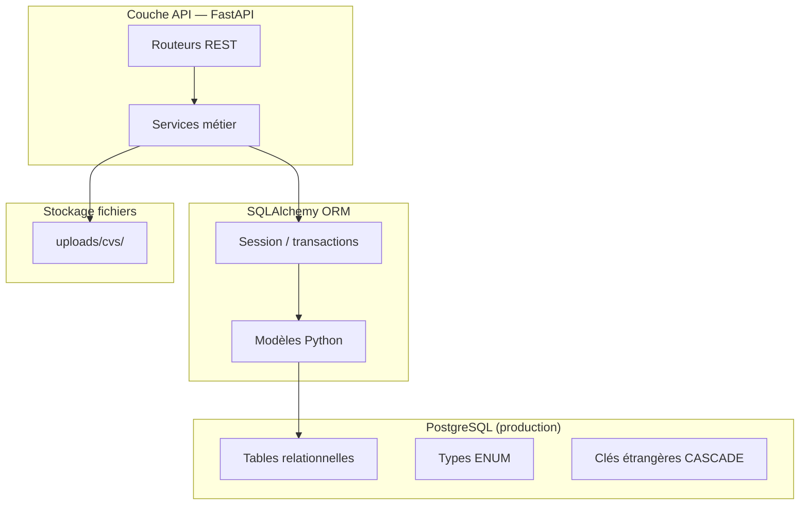
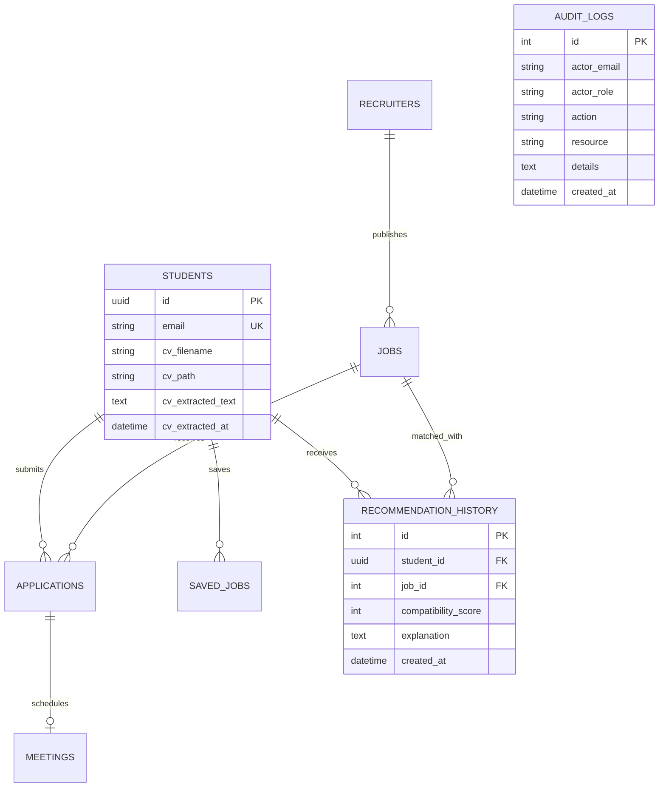

# MatiousHire — Couche données (PFE 2026)

Documentation technique pour le jury : **PostgreSQL**, **stockage CV**, **logs d'audit**, **historiques de recommandations**.

---

## 1. Rôle de la couche données

La couche données assure la **persistance fiable** de toute l'information métier et IA :

| Responsabilité | Description |
|----------------|-------------|
| **Identités & profils** | Étudiants, candidats, recruteurs, admins |
| **Offres & candidatures** | Jobs, applications, saved_jobs |
| **CV** | Fichiers sur disque + métadonnées et texte extrait en base |
| **IA / traçabilité** | Historique des recommandations, scores, explications |
| **Supervision** | Journaux d'audit des actions sensibles |
| **Plateforme** | Meetings, notifications, créneaux d'entretien |

Elle est **découplée** de la couche API (FastAPI) via SQLAlchemy ORM et des migrations Alembic.

---

## 2. Architecture globale



**En développement / tests :**

| Environnement | SGBD | Fichiers CV |
|---------------|------|-------------|
| Production | PostgreSQL | `uploads/cvs/` |
| Dev local | PostgreSQL ou SQLite | `uploads/cvs/` |
| pytest | SQLite in-memory | répertoire temporaire |

---

## 3. PostgreSQL — schéma relationnel

### 3.1 Connexion

```env
DATABASE_URL=postgresql://postgres@localhost:5432/recruitment_db
```

Configurée dans `app/database.py` :

- `create_engine()` avec `pool_pre_ping` (reconnexion automatique)
- `SessionLocal` — une session par requête HTTP
- Rollback automatique en cas d'exception

### 3.2 Migrations Alembic

Le schéma évolue de façon **versionnée** (`backend/migrations/versions/`) :

| Migration | Contenu |
|-----------|---------|
| `0001` | Schéma initial (students, recruiters, jobs, applications) |
| `0002–0004` | Profils, stages, candidatures |
| `0006` | `cv_extracted_text`, `cv_extracted_at` |
| `0007` | Admin, meetings, notifications, **recommendation_history**, **audit_logs** |
| `0008–0009` | Planification intelligente, `account_kind` |

Bootstrap SQL alternatif : `backend/create_db.sql` (PostgreSQL natif, extensions UUID).

### 3.3 Modèle entité-relation (simplifié)



### 3.4 Tables principales

| Table | Rôle |
|-------|------|
| `students` | Profils étudiant **et** candidat (`account_kind`) |
| `recruiters` | Comptes recruteurs |
| `admins` | Comptes administrateur |
| `jobs` | Offres d'emploi |
| `applications` | Candidatures + `match_score` |
| `saved_jobs` | Offres favorites |
| `meetings` | Entretiens planifiés |
| `notifications` | Alertes utilisateur |
| `recommendation_history` | **Historique IA** — scores et explications |
| `audit_logs` | **Journal d'audit** — actions plateforme |

### 3.5 Intégrité référentielle

- Clés étrangères avec `ON DELETE CASCADE` (suppression profil → candidatures, historiques)
- Contraintes `UNIQUE` (email, candidature student+job)
- Types ENUM PostgreSQL (`jobstatus`, `applicationstatus`, `notificationtype`, …)

---

## 4. Stockage CV (hybride fichier + base)

Le CV utilise un modèle **hybride** : le fichier binaire reste sur le disque, les métadonnées et le texte extrait sont en PostgreSQL.

### 4.1 Flux upload

```
POST /students/me/cv  (ou /candidates/me/cv)
        │
        ▼
CvService.upload()
        │
        ├─► validate_cv_file()     — extension, taille max 5 Mo
        ├─► save_cv_file()         — uploads/cvs/{uuid}_{filename}
        ├─► extract_raw_text()     — PDF / DOCX / TXT (pypdf)
        ├─► extract_skills_from_text()
        └─► UPDATE students SET cv_filename, cv_path,
                               cv_extracted_text, cv_extracted_at,
                               technical_skills
```

### 4.2 Colonnes CV (`students`)

| Colonne | Type | Rôle |
|---------|------|------|
| `cv_filename` | VARCHAR(255) | Nom original du fichier |
| `cv_path` | VARCHAR(500) | Chemin relatif sur disque |
| `cv_extracted_text` | TEXT | Texte brut extrait (entrée NLP / matching) |
| `cv_extracted_at` | TIMESTAMP | Date d'extraction |

### 4.3 Règles de stockage fichier

Module : `app/modules/cv/storage.py`

| Règle | Valeur |
|-------|--------|
| Répertoire | `uploads/cvs/` |
| Extensions | `.pdf`, `.doc`, `.docx`, `.txt` |
| Taille max | 5 Mo |
| Nommage | `{student_uuid}_{nom_sécurisé}` |

### 4.4 Consommation par l'IA

Le texte extrait alimente directement le pipeline de matching :

- `MatchingService.profile_from_student()` → `cv_extracted_text`
- Extraction compétences → enrichissement `technical_skills`
- Similarité TF-IDF CV ↔ description offre

---

## 5. Logs d'audit (`audit_logs`)

### 5.1 Objectif

Tracer les **actions sensibles** pour la supervision admin et la conformité :

- Qui a fait quoi, quand, sur quelle ressource
- Filtrage par rôle et type d'action dans l'UI admin

### 5.2 Modèle

```python
# app/models/platform.py — AuditLog
actor_email   # ex. recruiter.demo2026@example.com
actor_role    # student | candidate | recruiter | admin
action        # code machine ex. upload_cv, rank_candidates
resource      # ID cible (job_id, application_id, …)
details       # texte libre complémentaire
created_at    # horodatage UTC
```

### 5.3 Enregistrement

```python
from app.modules.platform.audit import AuditAction, record_audit

record_audit(
    db,
    actor_email=current.email,
    actor_role="recruiter",
    action=AuditAction.RANK_CANDIDATES,
    resource=str(job.id),
    details=f"{len(ranked)} candidats classés",
)
```

### 5.4 Actions couvertes (extrait)

| Catégorie | Actions |
|-----------|---------|
| Auth | `login`, `register_*` |
| Profil / CV | `update_profile`, `upload_cv`, `delete_cv` |
| Offres | `create_job`, `update_job`, `delete_job` |
| Candidatures | `apply_job`, `shortlist_application`, `hire_application` |
| IA | `run_matching_score`, `rank_candidates` |
| Admin | `create_student`, `delete_recruiter`, … |

### 5.5 API & UI

- `GET /admin/audit-logs?role=&action=&limit=100`
- Page frontend : `/admin/audit-logs`

---

## 6. Historiques de recommandations (`recommendation_history`)

### 6.1 Objectif

Persister chaque session de recommandation IA pour :

- **Analyse** : quelles offres ont été proposées, avec quel score
- **Traçabilité** : explication stockée au moment du calcul
- **Statistiques admin** : `total_recommendations` sur le dashboard

### 6.2 Modèle

```python
# app/models/platform.py — RecommendationHistory
student_id           # FK → students
job_id               # FK → jobs
compatibility_score  # 0–100
explanation          # texte généré par le pipeline IA
created_at           # horodatage
```

### 6.3 Enregistrement automatique

À chaque appel `GET /matching/students|/candidates/me/recommendations` :

```python
# app/modules/matching/service.py
ranked = MatchingService.recommend_jobs(db, student, ...)
MatchingService.record_recommendations(db, student, ranked)
db.commit()
```

### 6.4 Consultation

- API LLM : historique récent pour contextualiser les explications
- Admin dashboard : compteur global

---

## 7. Séparation des responsabilités

| Composant | Fichier | Rôle |
|-----------|---------|------|
| Connexion DB | `app/database.py` | Engine, session, Base |
| Modèles ORM | `app/models/` | Tables SQLAlchemy |
| Migrations | `migrations/versions/` | Évolution schéma |
| CV fichiers | `app/modules/cv/storage.py` | Disque |
| CV métier | `app/modules/cv/service.py` | Upload + extraction + DB |
| Audit | `app/modules/platform/audit.py` | `record_audit()` |
| Historique reco | `app/modules/matching/service.py` | `record_recommendations()` |

---

## 8. Tests automatisés (pytest)

La couche données est couverte par des tests dédiés :

| Fichier | Vérifie |
|---------|---------|
| `tests/test_data_cv_storage.py` | Validation, save/delete fichiers CV |
| `tests/test_data_audit.py` | Création et lecture audit_logs |
| `tests/test_data_history.py` | Enregistrement recommendation_history |

Commande :

```powershell
cd Project\backend
pytest tests/test_data_*.py -v
```

---

## 9. Message jury (30 secondes)

> La couche données de MatiousHire repose sur **PostgreSQL** pour la persistance relationnelle, un **stockage hybride des CV** (fichiers + texte extrait en base pour le NLP), des **journaux d'audit** pour tracer toutes les actions sensibles, et un **historique des recommandations IA** pour la traçabilité des scores. Le schéma est versionné par **Alembic**, avec intégrité référentielle et tests pytest automatisés.

---

*MatiousHire — PFE 2026 — Couche données*
