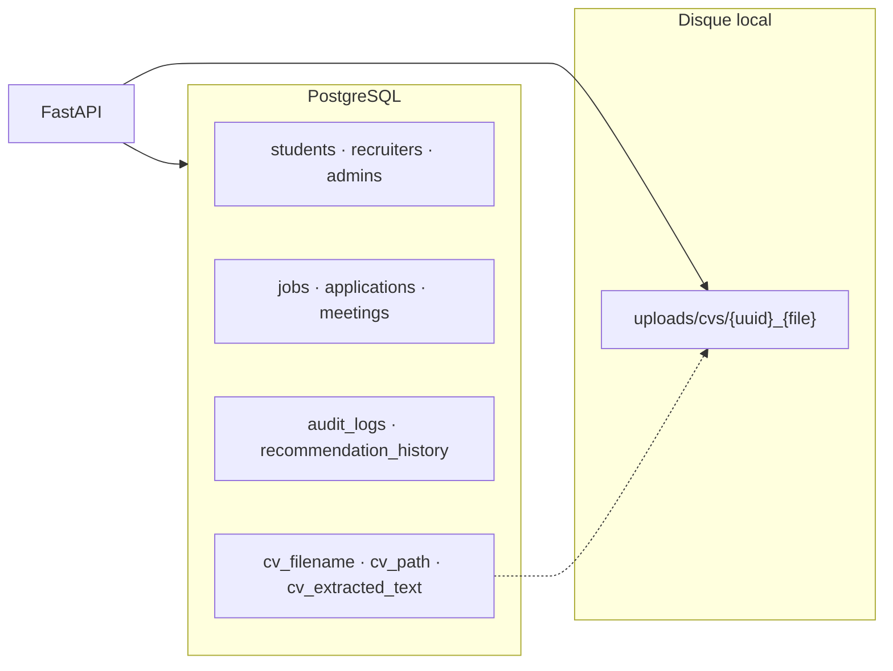

# MatiousHire — Présentation complète pour le jury PFE 2026
## Stage de 4 mois — Plateforme RH intelligente

---

## 0. Identité du projet (à dire en 30 secondes)

**MatiousHire** est une plateforme web de recrutement intelligente qui aide :

- le **candidat / étudiant** à trouver des offres adaptées à son CV ;
- le **recruteur** à classer automatiquement les candidatures ;
- l’**administrateur** à superviser la plateforme.

La valeur ajoutée du PFE n’est pas seulement un site CRUD : c’est un **moteur IA de matching CV–offre**, avec **score de compatibilité**, **recommandations**, et **explications LLM** pour que le score soit **compréhensible** (IA explicable).

**Stack :** Next.js (frontend) + FastAPI (backend) + PostgreSQL + modules NLP/Matching/LLM.

---

## 1. Contexte et problématique

### 1.1 Contexte métier
Les entreprises reçoivent un volume élevé de candidatures. Le tri manuel est :
- **lent** (lecture ligne par ligne des CV) ;
- **subjectif** (biais du recruteur) ;
- **peu scalable** (impossibilité de traiter des centaines de CV rapidement).

Côté candidats, les offres sont nombreuses et mal ciblées : le candidat ne sait pas **pourquoi** une offre lui correspond.

### 1.2 Problématique scientifique / technique
Comment comparer automatiquement un **CV** et une **offre d’emploi** pour produire :
1. un **score de compatibilité** mesurable ;
2. un **classement** des candidats / des offres ;
3. une **explication lisible** (compétences manquantes, points forts) ?

### 1.3 Objectifs du stage (4 mois)
| Objectif | Description |
|----------|-------------|
| **O1** | Concevoir une architecture logicielle modulaire full-stack |
| **O2** | Développer les modules métier (auth, utilisateurs, offres, CV, meetings) |
| **O3** | Implémenter le pipeline ML/NLP de matching multi-critères |
| **O4** | Intégrer un module LLM d’explication et de résumés |
| **O5** | Livrer des interfaces pour étudiant, candidat, recruteur, admin |
| **O6** | Documenter et démontrer le système pour la soutenance |

---

## 2. Périmètre fonctionnel

### 2.1 Rôles

| Rôle | Besoins couverts |
|------|------------------|
| **Étudiant** | Profil académique, stages observation/opérationnel, offres, CV, recommandations |
| **Candidat** | Profil pro, toutes durées de stage (dont **fonctionnel 4–6 mois**), matching IA |
| **Recruteur** | Publier offres, pipeline classé, scores, explications IA, planifier entretiens |
| **Administrateur** | Stats plateforme, utilisateurs, journaux d’audit |

### 2.2 Fonctionnalités principales
1. Inscription / connexion (JWT)  
2. Gestion de profils (CRUD)  
3. Upload CV (PDF / DOCX / TXT) + extraction de texte  
4. CRUD des offres d’emploi  
5. Calcul du score de matching CV–offre  
6. Recommandation d’offres au candidat  
7. Classement des candidats pour une offre  
8. Explication LLM (résumés, compétences manquantes, conseils)  
9. Planification des entretiens + notifications  
10. Tableaux de bord (candidat, recruteur, admin)  
11. Historique des recommandations  

---

## 3. Architecture logique (Figure 4.1)

```
┌──────────────────────────────────────────────────────────────┐
│ Couche présentation : Next.js, Tailwind CSS (CSS custom),   │
│                       Fetch API                              │
├──────────────────────────────────────────────────────────────┤
│ Couche API          : FastAPI, JWT, REST, validation Pydantic│
├──────────────────────────────────────────────────────────────┤
│ Couche métier       : users, offers, CV, recommandations,    │
│                       réunions, notifications, admin         │
├──────────────────────────────────────────────────────────────┤
│ Couche IA           : NLP, extraction, matching, embeddings, │
│                       LLM explicable                         │
├──────────────────────────────────────────────────────────────┤
│ Couche données      : PostgreSQL, stockage CV, logs,         │
│                       historiques                            │
├──────────────────────────────────────────────────────────────┤
│ Couche DevOps (cible / perspectives) : Docker, CI, cloud     │
└──────────────────────────────────────────────────────────────┘
```

**Pourquoi cette découpe ?**  
Séparation des responsabilités (SRP), évolution indépendante du moteur IA, démonstration claire devant jury.

---

## 4. Plan de stage sur 4 mois

| Mois | Thème | Livrables concrets |
|------|--------|--------------------|
| **Mois 1** | Cadrage + architecture + fondations | Analyse besoin, schéma DB, auth JWT, squelette Next.js/FastAPI, migrations Alembic |
| **Mois 2** | Modules métier | CRUD utilisateurs/offres, upload CV, extraction texte, dashboards de base, student vs candidate |
| **Mois 3** | Moteur IA matching | NLP, TF-IDF, embeddings synonymes, score multi-critères, API recommandation & ranking |
| **Mois 4** | LLM + intégration + soutenance | Module LLM, meetings/admin, UI explications, docs jury, tests, démo bout-en-bout |

### Lien avec le stage *fonctionnel* (4–6 mois)
Dans le domaine métier de MatiousHire, le **stage fonctionnel** (4–6 mois) est le type de stage le plus long, destiné aux profils plus avancés (candidates).  
Le projet PFE lui-même s’inscrit dans un **cadre de 4 mois** de développement logiciel — durée typique d’un stage PFE / stage de fin d’études.

---

## 5. Stack technique et justifications (jury)

| Technologie | Rôle | Justification |
|-------------|------|---------------|
| **Next.js 15** | Frontend App Router | Performance, routing, UI moderne |
| **React 19** | Composants UI | Composants réutilisables (student/candidate partagés) |
| **Fetch API** | Client HTTP | Simple, natif, suffisant pour le CRUD + IA |
| **FastAPI** | Backend REST | Rapide, docs Swagger auto, Python = natural pour l’IA |
| **SQLAlchemy + Alembic** | ORM + migrations | Modèles typés, évolution contrôlée du schéma |
| **PostgreSQL** | SGBD | Relationnel, robuste, adapté RH |
| **pypdf** | Extraction PDF | Léger, sans dépendance lourde GPU |
| **Modules NLP maison** | Matching | Explicable, adapté PFE (pas de boîte noire opaque) |
| **JWT (custom HMAC)** | Auth | Stateless, rôles dans le token |

---

## 6. Couche présentation (Frontend) — détail

### 6.1 Pages principales
| Route | Acteur | Contenu |
|-------|--------|---------|
| `/login` | Tous | Inscription / connexion multi-rôles |
| `/student/*` | Étudiant | Dashboard, jobs, profil |
| `/candidate/*` | Candidat | Dashboard, jobs + reco IA, profil |
| `/recruiter/pipeline` | Recruteur | Classement candidats + explication IA |
| `/recruiter/jobs` | Recruteur | Création d’offres |
| `/recruiter/meetings` | Recruteur | Entretiens planifiés |
| `/admin/dashboard` | Admin | Stats + audit |

### 6.2 Composants clés
- `AuthExperience` : sélection du rôle (Student / Candidate / Recruiter / Admin)  
- `ApplicantJobsPanel` : offres + top matches IA  
- `ProfilePanel` : profil + upload CV  
- `LlmExplanationPanel` : résumé, compétences manquantes, tips  
- `RequireAuth` : protection des routes par rôle  

### 6.3 Différenciation étudiant / candidat
| Critère | Étudiant | Candidat |
|---------|----------|----------|
| Objectif | intercalaire scolaire | insertion / stage long |
| Types de stage | observation, opérationnel | + **fonctionnel (4–6 mois)** |
| UI | thème / checklist académique | thème / checklist carrière |

---

## 7. Couche backend — détail

### 7.1 Routeurs FastAPI
`/auth`, `/students`, `/candidates`, `/recruiters`, `/jobs`, `/matching`, `/llm`, `/meetings`, `/admin`

### 7.2 Modules métier
| Module | Responsabilité |
|--------|----------------|
| `users` | CRUD profils |
| `offers` | CRUD offres |
| `cv` | Stockage + extraction + skills |
| `platform` | Meetings, notifications, audit |
| `matching` | Score + reco + ranking |
| `llm` | Explications + résumés |

### 7.3 Sécurité
- Hash mots de passe **PBKDF2**  
- Token JWT avec `role` + expiration  
- Dépendances FastAPI (`get_current_student`, `…_candidate`, `…_recruiter`, `…_admin`)

---

## 8. Couche IA — le cœur du PFE

### 8.1 Pipeline CV
```
Upload → Stockage → Extraction texte (PDF/DOCX/TXT)
      → Détection compétences → Enrichissement profil
```

### 8.2 Pipeline Matching (6 étapes)
1. Collecte profil + offre  
2. Prétraitement NLP (tokenisation, stop-words FR/EN)  
3. Features (skills, TF-IDF, synonymes)  
4. Scoring multi-critères  
5. Explication LLM  
6. Classement  

### 8.3 Formule de score (implémentée)
\[
S = 100 \times (
0{,}35\,S_{\text{skills}} +
0{,}25\,S_{\text{experience}} +
0{,}20\,S_{\text{semantic}} +
0{,}10\,S_{\text{education}} +
0{,}05\,S_{\text{location}} +
0{,}05\,S_{\text{availability}}
)
\]

### 8.4 Approches combinées (Axe matching)
1. **Mots-clés** — simple, interprétable  
2. **TF-IDF + cosinus** — similarité textuelle  
3. **Embeddings / synonymes** — NLP ≈ TALN  
4. **Fusion pondérée** — score final explicable  

### 8.5 Module LLM explicable
Produits :
- résumé CV / offre  
- explication du score  
- **compétences manquantes**  
- points forts + conseils  
- questions d’entretien  

**Message jury :** *« Le LLM est une aide à la décision ; le recruteur reste responsable. »*

---

## 9. Couche données — PostgreSQL, stockage CV, logs, historiques

> Documentation détaillée : [`docs/PFE_COUCHE_DONNEES.md`](PFE_COUCHE_DONNEES.md)

### 9.1 Vue d'ensemble



| Composant | Technologie | Rôle |
|-----------|-------------|------|
| **SGBD** | PostgreSQL (+ SQLite dev/test) | Persistance relationnelle |
| **ORM** | SQLAlchemy 2.x | Modèles typés Python |
| **Migrations** | Alembic | Évolution contrôlée du schéma |
| **CV fichiers** | `uploads/cvs/` | PDF, DOCX, TXT (max 5 Mo) |
| **CV texte** | Colonnes `students` | Entrée NLP / matching IA |
| **Audit** | Table `audit_logs` | Traçabilité actions (auth, CV, IA, admin) |
| **Historique IA** | Table `recommendation_history` | Scores + explications par session |

### 9.2 PostgreSQL — tables principales

`students`, `recruiters`, `admins`, `jobs`, `applications`, `saved_jobs`,  
`meetings`, `notifications`, `interview_slots`, `candidate_availabilities`,  
`recommendation_history`, `audit_logs`

- UUID pour les identités utilisateur  
- SERIAL pour jobs, applications, logs  
- ENUM PostgreSQL (`jobstatus`, `applicationstatus`, …)  
- `ON DELETE CASCADE` pour cohérence référentielle  

### 9.3 Stockage CV (hybride)

| Couche | Contenu |
|--------|---------|
| **Fichier** | `uploads/cvs/{student_id}_{nom_fichier}` |
| **Base** | `cv_filename`, `cv_path`, `cv_extracted_text`, `cv_extracted_at` |
| **Pipeline** | Upload → validation → extraction pypdf → détection compétences → profil enrichi |

Le texte extrait alimente directement le moteur de matching (TF-IDF, skills).

### 9.4 Logs d'audit

Chaque action sensible appelle `record_audit()` :

- Connexion, inscription, upload/suppression CV  
- CRUD offres, candidatures, entretiens  
- Classement IA des candidats (`rank_candidates`)  

Consultation : `GET /admin/audit-logs` + page `/admin/audit-logs`.

### 9.5 Historiques de recommandations

À chaque `GET /matching/.../me/recommendations` :

1. Calcul des scores pour toutes les offres ouvertes  
2. Tri décroissant par compatibilité  
3. **Persistance** dans `recommendation_history` (score + explication + timestamp)  

Permet traçabilité IA et statistiques admin (`total_recommendations`).

### 9.6 Tests couche données

pytest vérifie stockage CV, audit logs et historiques (`tests/test_data_*.py`).

---

## 10. Scénario de démonstration jury (10–12 min)

| Temps | Action | Message à faire passer |
|-------|--------|------------------------|
| 0–1 min | Problème + objectifs | Besoin RH + IA |
| 1–2 min | Architecture 6 couches | Modularité |
| 2–4 min | Swagger `/matching/pipeline` + `/llm/module` | Transparence algorithmes |
| 4–6 min | Login **candidat** → jobs → reco IA → explication LLM | Valeur pour le candidat |
| 6–8 min | Login **recruteur** → pipeline → ranking + IA | Aide au shortlist |
| 8–9 min | Upload CV / extraction | Qualité des données |
| 9–10 min | Admin dashboard | Supervision |
| 10–12 min | Limites + perspectives | Maturité scientifique |

### Comptes de démo
| Rôle | Email | Mot de passe |
|------|-------|--------------|
| Candidat | `candidate.demo2026@example.com` | `Password123` |
| Recruteur | `recruiter.demo2026@example.com` | `Password123` |
| Admin | `admin@matioushire.com` | `Password123` |

---

## 11. Résultats attendus / obtenus

| Critère | Résultat |
|---------|----------|
| Application full-stack | Opérationnelle (Next.js + FastAPI + PostgreSQL) |
| Matching multi-critères | Score 0–100 + classement |
| Recommandations | API + UI candidat |
| Explicabilité | Module LLM + panneau UI |
| Multi-rôles | Student / Candidate / Recruiter / Admin |
| Documentation | Docs PFE (fonctionnalités, matching, LLM, présentation) |

---

## 12. Limites et perspectives (honnêteté scientifique)

### Limites actuelles
- Embeddings = synonymes métier (pas encore Sentence-BERT / GPU)  
- LLM = génération **règles + templates** (pas un grand modèle cloud obligatoire)  
- Pas encore de modèle supervisé sur dataset d’embauches annoté  

### Perspectives (post-PFE / mois 5–6 si prolongation)
- Sentence-BERT / MiniLM pour similarité sémantique profonde  
- LLM externe (OpenAI / Ollama) pour textes plus riches  
- Learning-to-rank / Random Forest si dataset disponible  
- Docker Compose + CI GitHub Actions + déploiement cloud (S3/RDS/EC2)  

---

## 13. Conclusion (slide finale)

**MatiousHire** livre, en **4 mois de stage**, une plateforme RH intelligente complète :

1. **Produit** : parcours candidat et recruteur de bout en bout  
2. **Science** : matching NLP multi-critères + score explicable  
3. **Éthique IA** : explications LLM, recruteur reste décideur  
4. **Ingénierie** : architecture modulaire, API REST documentée, PostgreSQL  

Le projet répond à la problématique du **tri automatisé et transparent** des candidatures, avec une trajectoire claire vers des embeddings et LLM plus avancés.

---

## 14. Documents associés

| Fichier | Contenu |
|---------|---------|
| `docs/PFE_FONCTIONNALITES.md` | Fonctionnalités & rôles |
| `docs/PFE_ML_NLP_MATCHING.md` | Moteur matching |
| `docs/PFE_LLM_INTEGRATION.md` | Module LLM |
| `docs/PFE_COUCHE_DONNEES.md` | Couche données (PostgreSQL, CV, logs, historiques) |
| `docs/PFE_UML_MATIOUSHIRE.md` | Modélisation UML (cas d'utilisation, classes, séquences) |
| `docs/PFE_PRESENTATION_JURY_2026.md` | Ce document (présentation globale) |

---

*MatiousHire — PFE 2026 — Stage 4 mois — Présentation jury*
