# MatiousHire — Modélisation UML (PFE 2026)
## Diagrammes pour soutenance jury — Matious Digital × EMSI

> **Usage :** fichiers `.puml` prêts dans [`uml/`](uml/) — voir [`uml/README.md`](uml/README.md) pour export PNG / StarUML / draw.io.

---

## 1. Vue d'ensemble des diagrammes

### Architecture (PlantUML — dossier `uml/`)

| Fichier | Diagramme | Slide PFE |
|---------|-----------|-----------|
| `00_architecture_overview.puml` | Vue d'ensemble système | Slide 19 |
| `09_architecture_layers.puml` | **Architecture 6 couches** | Slide 19 |
| `10_architecture_context.puml` | Contexte (acteurs + Matious Digital) | Slide 4/19 |
| `11_architecture_packages.puml` | Packages backend/frontend | Annexe |
| `12_architecture_ia_module.puml` | Module IA interne | Slide 20 |
| `13_architecture_data_flow.puml` | Flux de données | Slide 20 |
| `14_architecture_frontend.puml` | Architecture Next.js | Slide 6 |
| `06_components.puml` | Composants (simplifié) | Slide 19 |
| `07_deployment.puml` | Déploiement | Slide 25 |

### UML métier & séquences

| Diagramme UML | Objectif jury | Slide PFE |
|---------------|-------------|-----------|
| **Cas d'utilisation** | Acteurs + fonctionnalités | Slide 22 |
| **Classes** | Modèle de données métier | Slide 21 |
| **Séquence — Recommandation IA** | Flux matching ML/NLP | Slide 20 / démo |
| **Séquence — Upload CV** | Flux couche données | Slide 33 |
| **Séquence — Classement recruteur** | Pipeline RH | Slide 31 |
| **Activité — Pipeline IA** | Scoring 6 critères | Slide 20 |

---

## 2. Diagramme de cas d'utilisation

### 2.1 Description textuelle

**Acteurs principaux :**
- **Étudiant** — profil académique, stages observation/opérationnel
- **Candidat** — profil professionnel, stage fonctionnel 4–6 mois
- **Recruteur** — gestion offres et pipeline candidats
- **Administrateur** — supervision plateforme
- **Système IA** — acteur secondaire (matching, LLM, extraction CV)

**Packages fonctionnels :**
1. Authentification  
2. Gestion profil & CV  
3. Offres & candidatures  
4. Matching & recommandations IA  
5. Entretiens & notifications  
6. Administration & audit  

### 2.2 Diagramme (Mermaid)

```mermaid
flowchart TB
    subgraph Auth["Package Authentification"]
        UC1[S'inscrire]
        UC2[Se connecter]
    end

    subgraph Profil["Package Profil & CV"]
        UC3[Gérer profil]
        UC4[Uploader CV]
        UC5[Consulter texte extrait]
    end

    subgraph Offres["Package Offres"]
        UC6[Consulter offres]
        UC7[Publier offre]
        UC8[Postuler]
        UC9[Sauvegarder offre]
    end

    subgraph IA["Package Matching IA"]
        UC10[Obtenir recommandations]
        UC11[Calculer score compatibilité]
        UC12[Classer candidats]
        UC13[Consulter explication LLM]
    end

    subgraph Entretiens["Package Entretiens"]
        UC14[Planifier entretien]
        UC15[Gérer disponibilités]
        UC16[Confirmer / Refuser entretien]
    end

    subgraph AdminPkg["Package Administration"]
        UC17[Consulter dashboard]
        UC18[Gérer utilisateurs]
        UC19[Consulter audit logs]
    end

    Etudiant((Étudiant))
    Candidat((Candidat))
    Recruteur((Recruteur))
    Admin((Administrateur))
    SysIA((Système IA))

    Etudiant --> UC1 & UC2 & UC3 & UC4 & UC5 & UC6 & UC8 & UC9 & UC10 & UC13 & UC15 & UC16
    Candidat --> UC1 & UC2 & UC3 & UC4 & UC5 & UC6 & UC8 & UC9 & UC10 & UC13 & UC15 & UC16
    Recruteur --> UC2 & UC7 & UC12 & UC14 & UC16
    Admin --> UC2 & UC17 & UC18 & UC19

    UC4 -.-> SysIA
    UC10 -.-> SysIA
    UC11 -.-> SysIA
    UC12 -.-> SysIA
    UC13 -.-> SysIA
```

### 2.3 PlantUML (pour export figure)

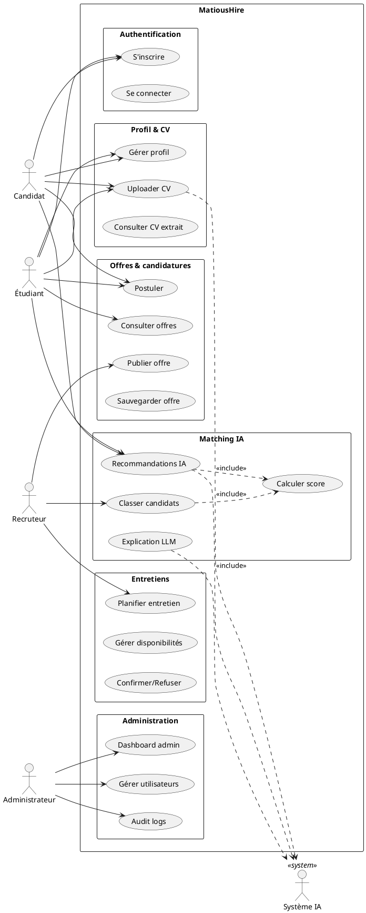

### 2.4 Table des cas d'utilisation (fiche jury)

| ID | Cas d'utilisation | Acteur | Précondition | Postcondition |
|----|-------------------|--------|--------------|---------------|
| UC01 | S'inscrire | Étudiant/Candidat/Recruteur | Email non utilisé | Compte créé + audit log |
| UC04 | Uploader CV | Étudiant/Candidat | Connecté | Fichier stocké + texte extrait |
| UC08 | Postuler | Étudiant/Candidat | Profil complet | Application créée |
| UC10 | Recommandations IA | Étudiant/Candidat | Profil + offres ouvertes | Liste triée par score + historique |
| UC12 | Classer candidats | Recruteur | Offre + candidatures | Pipeline trié + match_score |
| UC13 | Explication LLM | Étudiant/Candidat | Job_id valide | Texte explicatif affiché |
| UC19 | Audit logs | Admin | Connecté admin | Liste filtrée des actions |

---

## 3. Diagramme de classes

### 3.1 Description

Modèle **domaine métier** aligné sur SQLAlchemy (`app/models/`).  
`Student` porte les profils **étudiant** et **candidat** via `account_kind`.

### 3.2 Diagramme (Mermaid)

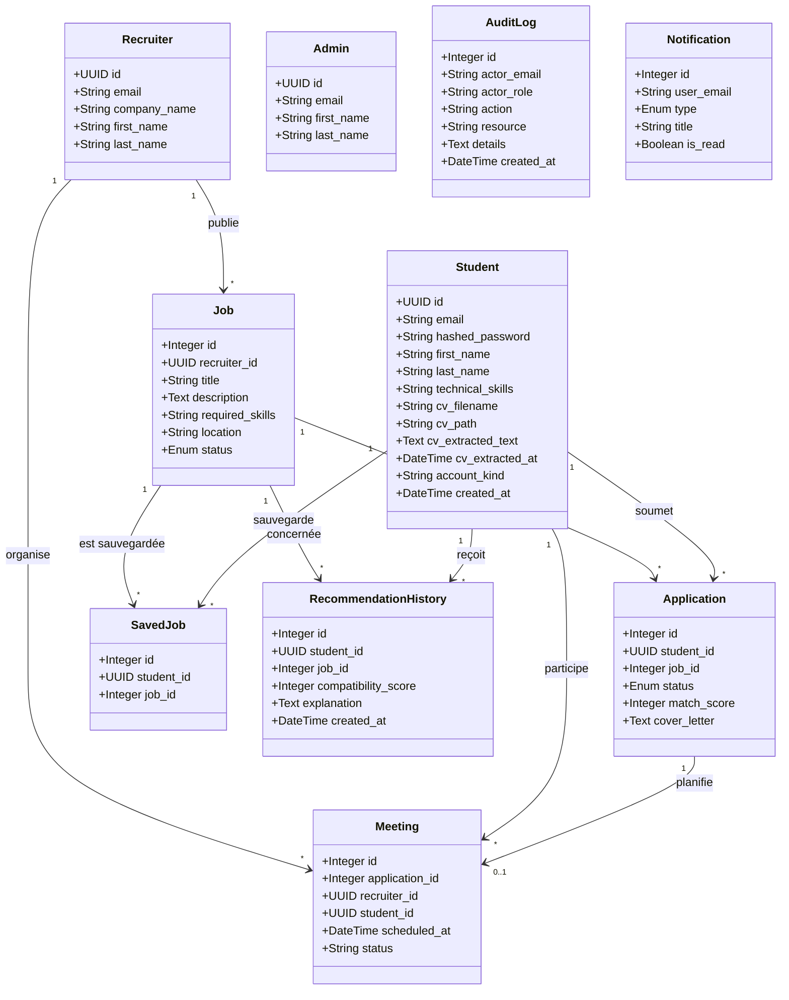

### 3.3 PlantUML — diagramme de classes complet

```plantuml
@startuml MatiousHire_Classes
skinparam classAttributeIconSize 0

enum JobStatus { open; closed }
enum ApplicationStatus { applied; shortlisted; interview_invited; rejected; hired }
enum NotificationType { recommendation; interview; system }

class Student {
  - id : UUID
  - email : String
  - hashed_password : String
  - first_name : String
  - last_name : String
  - technical_skills : Text
  - cv_filename : String
  - cv_path : String
  - cv_extracted_text : Text
  - cv_extracted_at : DateTime
  - account_kind : String
  --
  + updateProfile()
  + uploadCv()
}

class Recruiter {
  - id : UUID
  - email : String
  - company_name : String
  --
  + publishJob()
  + rankCandidates()
}

class Admin {
  - id : UUID
  - email : String
  --
  + manageUsers()
  + viewAuditLogs()
}

class Job {
  - id : Integer
  - title : String
  - description : Text
  - required_skills : Text
  - location : String
  - status : JobStatus
}

class Application {
  - id : Integer
  - status : ApplicationStatus
  - match_score : Integer
  - cover_letter : Text
}

class SavedJob { - id : Integer }
class Meeting { - id : Integer; - scheduled_at : DateTime; - status : String }
class RecommendationHistory { - compatibility_score : Integer; - explanation : Text }
class AuditLog { - action : String; - actor_email : String }
class Notification { - type : NotificationType; - is_read : Boolean }

Recruiter "1" -- "0..*" Job
Student "1" -- "0..*" Application
Job "1" -- "0..*" Application
Student "1" -- "0..*" SavedJob
Job "1" -- "0..*" SavedJob
Student "1" -- "0..*" RecommendationHistory
Job "1" -- "0..*" RecommendationHistory
Application "1" -- "0..1" Meeting
Student "1" -- "0..*" Meeting
Recruiter "1" -- "0..*" Meeting

@enduml
```

### 3.4 Classes services (couche métier — annexe technique)

| Classe | Package | Responsabilité |
|--------|---------|----------------|
| `MatchingService` | `matching/service.py` | recommend_jobs, rank_applications |
| `MatchingPipeline` | `matching/pipeline.py` | Orchestration 6 étapes IA |
| `CvService` | `cv/service.py` | Upload, extraction, suppression CV |
| `AuditService` | `platform/service.py` | Persistance audit_logs |
| `OfferService` | `offers/service.py` | CRUD offres |

---

## 4. Diagrammes de séquence

### 4.1 Séquence — Recommandation d'offres IA (UC10)

**Scénario principal :** le candidat consulte ses top matches.

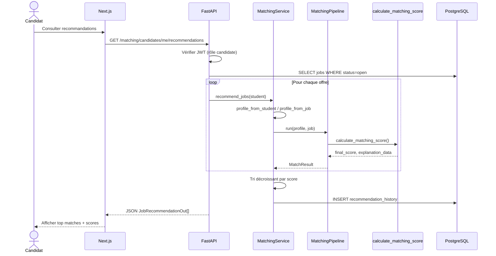

**PlantUML :**

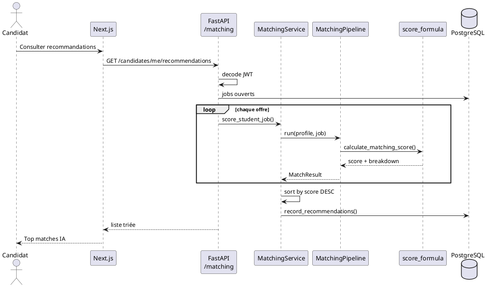

---

### 4.2 Séquence — Upload CV (UC04)

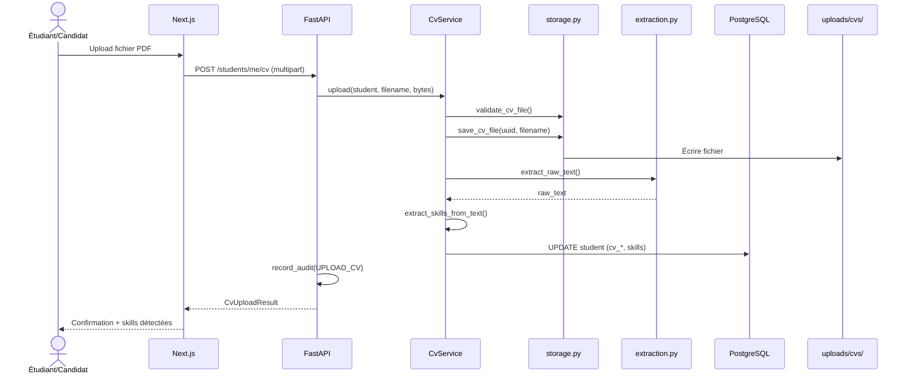

---

### 4.3 Séquence — Classement candidats recruteur (UC12)

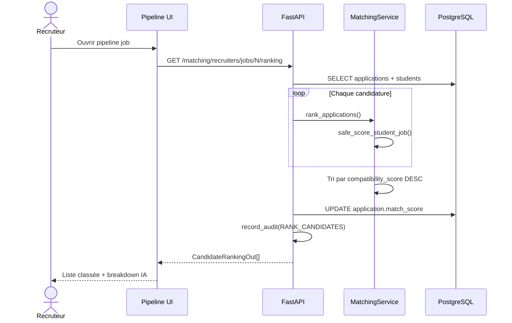

---

## 5. Diagramme de composants (architecture)

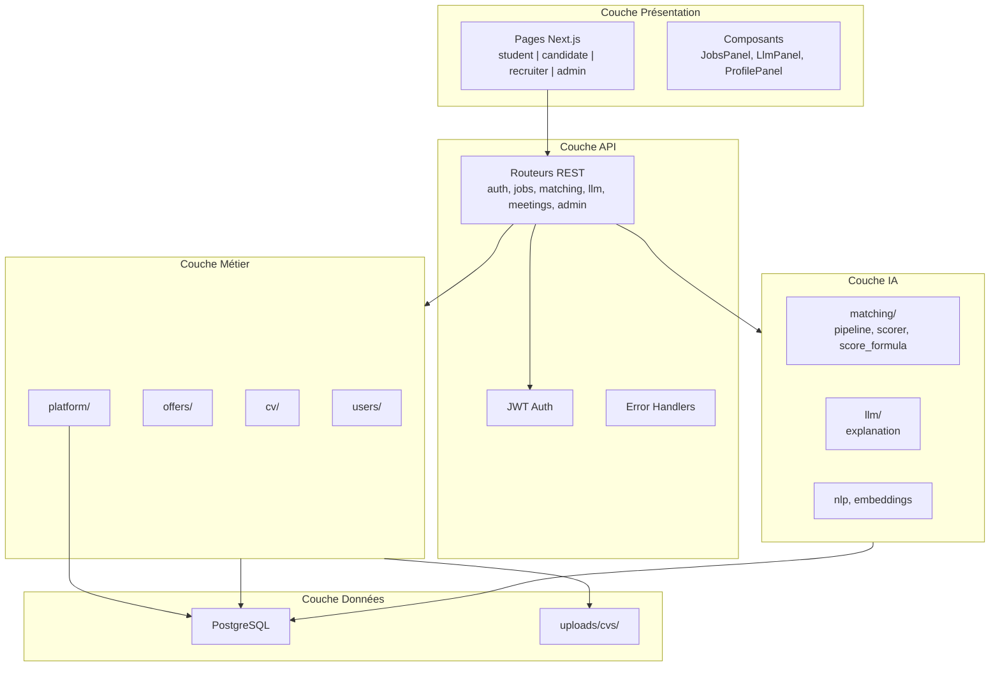

**PlantUML composants :**

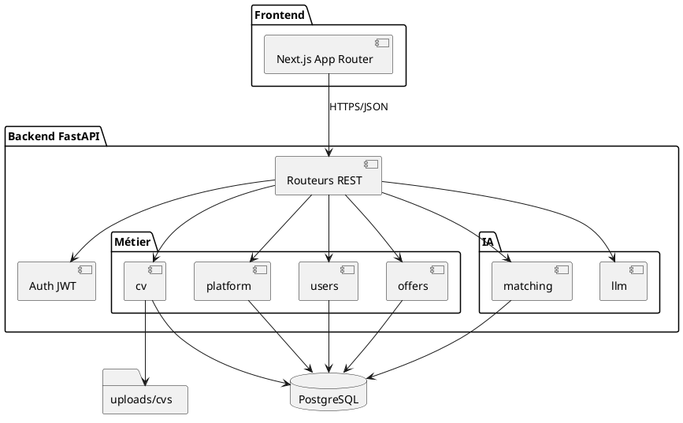

---

## 6. Diagramme de déploiement

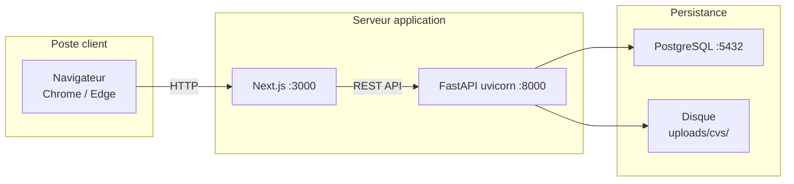

| Nœud | Technologie | Port |
|------|-------------|------|
| Client | Navigateur web | — |
| Frontend | Next.js 15 | 3000 |
| Backend | FastAPI + uvicorn | 8000 |
| SGBD | PostgreSQL | 5432 |
| Fichiers | Système de fichiers local | — |

---

## 7. Diagramme d'activité — Pipeline matching IA

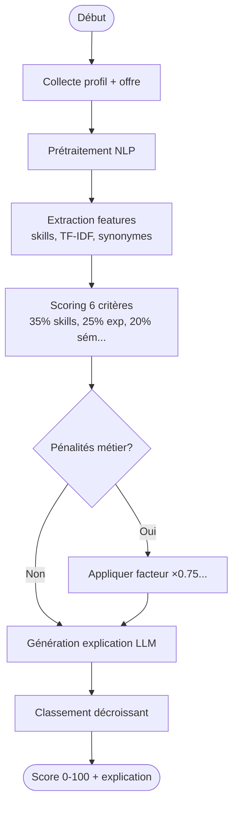

---

## 8. Légende UML pour le jury

| Symbole | Signification |
|---------|---------------|
| `<<include>>` | Un cas d'utilisation en inclut un autre (ex. Recommandation inclut Calcul score) |
| `..>` | Dépendance vers acteur système (IA) |
| `1 -- 0..*` | Un recruteur publie plusieurs offres |
| `UUID` | Identifiant universel (students, recruiters) |
| Acteur secondaire | Système IA — automatise sans interaction humaine directe |

---

## 9. Slides PowerPoint — quelle figure où

| Slide | Diagramme UML |
|-------|---------------|
| 19 | **`00_architecture_overview`** + **`09_architecture_layers`** + `06_components` |
| 20 | **`12_architecture_ia_module`** + `08_activity_matching` ou `03_seq_recommendation` |
| 21 | **`02_classes_resume_presentation.puml`** (slide jury) · annexe : `02_classes_methods.puml` |
| 22 | **Cas d'utilisation** (`01_use_case.puml`) |
| 25 | **Diagramme de déploiement** (`07_deployment.puml`) |
| 31 | **Séquence classement recruteur** (`05_seq_ranking.puml`) |
| 33 | **Séquence upload CV** (`04_seq_upload_cv.puml`) |
| 6 | **Architecture frontend** (`14_architecture_frontend.puml`) |
| Annexe | `11_architecture_packages` · `13_architecture_data_flow` · `10_architecture_context` |

---

## 10. Phrase oral jury (diagrammes UML)

> *« La modélisation UML de MatiousHire identifie quatre acteurs métier et un acteur système IA. Le diagramme de classes reflète le schéma PostgreSQL avec neuf entités principales. Les diagrammes de séquence montrent que chaque recommandation passe par le pipeline ML/NLP avant persistance dans recommendation_history, garantissant traçabilité et explicabilité. »*

---

*MatiousHire — UML PFE 2026 — Matious Digital × EMSI*
